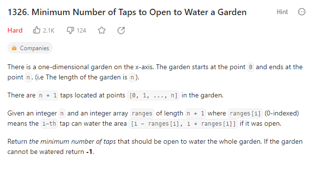

# Minimum Number of Taps to Open to Water a Garden



**My thoughts:**

First I come up with segment tree. Using segment tree, I can build a tree of which the node value would be the number of taps cover the specific interval.

However, the problem is that, here we need to find a best solution for the question. According to my understanding, the segment tree cannot help find the best solution.

Hence, I try to switch to backtracking algorithm and think whether it can be optimized using DP.

Then I need to find a good state for which I can define the state transfer function. Let A[n] indicates the number of taps opened to water the garden less than or equal to n. However, here comes the problem: I cannot find the state transfer function since I don't know the coverage of next tap and the status of the next tap (coverage) will affect the best solution we've found.

According to my understanding, the problem is that A[n] does not carry the tap data. Hence, I come up with storing the tap used in state. Let B[n] stores the set of taps opened to water the garden less than or equal to n. Then, for ranges[n+1], we only need to iterate B[n] to find whether to replace taps or not.

Hint: This method is called greedy method.

Learning: Stack is not a good container to iterate.

Then I write the following c++ code:

```c++
class Solution {
public:
    int minTaps(int n, vector<int>& ranges) {
        vector<bool> s(n + 1, 0);
        s[0] = 1;
        int cov_left = 0 - ranges[0], cov_right = 0 + ranges[0];
        
        // Special case
        if (n == 0) {
            return 1;
        }

        for(int i = 1; i < n + 1; ++i){
            // The new node does not contact with the already covered area
            if (i - ranges[i] > cov_right) continue;

            // The new node contact with the covered area
            if (i + ranges[i] > cov_right && cov_right < n) {
                s[i] = 1;
                cov_right = i + ranges[i];

                // Get rid of useless taps opened before index i
                for(int j = i - 1; j != -1; --j){
                    if(j - ranges[j] >= i - ranges[i]){
                        s[j] = 0;
                    } else if (i - ranges[i] <= 0 && j - ranges[j] <= 0) {
                        s[j] = 0;
                    } 
                }
            }
        }


        // The garden has not been all watered
        if (cov_right < n) return -1;

        return accumulate(s.begin(), s.end(), 0);
    }
};
```

However, my thought is not correct when I try to remove the already opened taps. This greedy algorithm thought is not correct.

## Correct Solution

The key idea to solve this problem is to think double-direction tap as single-direction tap, so that we can get the farthest reachable index for each point.

We sort all the taps according to their left most reachable index. It makes the next tap we choose will not affect the previous taps we choose (since it cannot reach as far as the previous opened taps). In this way, we can write the state transfer funciton.

