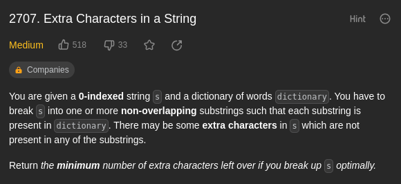

# 2707. Extra Characters in a String



**My thought:**

I didn't come up with dynamic programming at first because I don't know how to split the problem into child problems.

For every character `c` in the string `s`, I can make two decisions:

- Get rid of `c` in the sub problem
- Include `c` in the sub problem

First, try recursion method to solve the problem.

```text
Environment:

minChar(string s, vector<string>& dict)


Pseudo-code:

// Answer of sub problem without current last char
auto cnt = minChar(s.substr(0, s.len - 1), dict) + 1;
for pattern_str in dict:
    if s.len - pattern_str.len >= 0 && s.substr(s.len - pattern_str.len, s.len - 1) == pattern_str:
        auto cnt = min(cnt, minChar(s.substr(0, s.len - pattern_str.len - 1), dict));
return cnt;
```

However, this is fast enough. One point I can optimize is that I can use a hash table to store all the pattern strings so that I can quickly identify whether the current substring is in the pattern strings.

What's more, this solution is still from top to bottom. It has a lot of duplicate sub questions. We need to translate it to from bottom to top.

Finally come up with code:

```c++
class Solution {
public:
    int minExtraChar(string s, vector<string> &dictionary) {
        unordered_set<string> set(dictionary.begin(), dictionary.end());
        int n = s.size();
        vector<int> f(n + 1);
        for (int i = 0; i < n; i++) {
            f[i + 1] = f[i] + 1; // 不选
            for (int j = 0; j <= i; j++) { // 枚举选哪个
                if (set.count(s.substr(j, i - j + 1))) {
                    f[i + 1] = min(f[i + 1], f[j]);
                }
            }
        }
        return f[n];
    }
};
```
