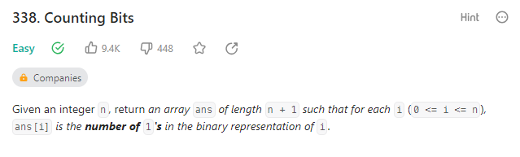

# 338. Counting Bits



My thought:

I first find that there is a pattern in the result.

```text
[2, 3] = [0, 1] + 1
[4, ..., 7] = [0, ..., 3] + 1
...
```

I find that when the start_idx = 2^x, the right side will start from 0 again. However, I don't want to examine whether the start_idx is a power of 2 because it will make the time complexity to O(nlogn) again.

Finally, I come up with slow fast pointer, and successfully come up with the following code:

```c++
class Solution {
public:
    vector<int> countBits(int n) {
        vector<int> res(n+1, 0);
        // Special case
        if (n == 0) return res;
        if (n == 1) {
            res[1] = 1;
            return res;
        }

        res[1] = 1;
        int slow = 0, fast = 2, fast_before = 2;
        for(;fast < n + 1; ++fast){
            if (slow == fast_before) {
                slow = 0;
                fast_before = fast;
            }
            res[fast] = res[slow] + 1;
            ++slow;
        }
        return res;
    }
};
```