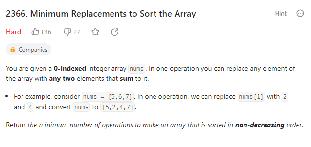

# 2366 Minimum Replacements to Sort the Array



## Thoughts

Obstacles:

- How to quickly determine whether the whole array has already been sorted non-decreasingly?

My thoughts:

Let $A[i] = x$ indicate that the minimum replacement to sort subarray nums[0, i] is x. Want to find the state transfer function.

However, when I try to find the $A[i+1]$, I feel that $nums[i+1]$ will decide whether we will need to replace the $nums[i]$. The actions to $nums[i]$ will affect the $A[i]$ since it has changed the state of $nums[i]$. I think it will not work.

Then, I try to think from backward of the array, since the replace action can only make the number smaller. Hence, to minimize the replacement, when we split the number n in to n1, n2, ..., nk, we should make n1 as large as possible.

As $n1 \leq n2 \leq ... \leq nk$, we should replace n as equally as possible.

Let $A[i] = x$ indicate that the minimum replacement to sort subarray nums[i, ] is x.

```text
Scenario:
Array nums
Know A[i], calculate A[i-1]

Pseudo Code:

if nums[i-1] <= nums[i]
    A[i-1] = A[i]
else
    dividend = 2
    while(true){
        if (A[i-1] / dividend < nums[i]){
            break
        } else if (A[i-1] / dividend == nums[i] && A[i-1] % dividend == 0){
            break
        } else {
            ++dividend
        }
    }
    A[i-1] = A[i] + dividend - 1
```

According to the pseudo code, we need to store the first number (which is the smallest number) n[i] of A[i].

According to this pseudo code, I write the following c++ code:

```c++
class Solution {
public:
    long long minimumReplacement(vector<int>& nums) {
        auto size = nums.size();
        // Special Condition
        if (size == 1) return 0;

        int n_i = nums[size - 1];
        int cnt_replace = 0;
        
        for(int idx = nums.size() - 2; idx >= 0; --idx){
            if (nums[idx] <= n_i) {
                n_i = nums[idx];
                continue;
            } else {
                int dividend = 2;
                while(true){
                    if(nums[idx] / dividend < n_i){
                        break;
                    } else if (nums[idx] / dividend == n_i && nums[idx] % dividend == 0) {
                        break;
                    }
                    ++dividend;
                }
                n_i = nums[idx] / dividend;
                cnt_replace += dividend - 1;
            }
        }
        return cnt_replace;
    }
};
```

It has solved many test cases, but met with time exceeded error in the following test case：

```text
[10000000, 10000000, ..., 10000000, 1]
```

I think the problem is that I've spent too much time on finding the number `n_i`.

I am so stupid! To find the minimum b which meets $a / b <= t$, I don't to iterate b from 2 and break the loop when the condition has been met. I can directly calculate $a / t$ and b would be either $a/t$ or $a/t + 1$.

Hence, I write the following c++ code, and pass all the test cases:

```c++
class Solution {
public:
    long long minimumReplacement(vector<int>& nums) {
        auto size = nums.size();
        // Special Condition
        if (size == 1) return 0;

        int n_i = nums[size - 1];
        long long cnt_replace = 0;
        int dividend = 0;
        
        for(int idx = nums.size() - 2; idx >= 0; --idx){
            if (nums[idx] <= n_i) {
                n_i = nums[idx];
            } else {
                // a/b < t
                dividend = nums[idx] / n_i;
                if (nums[idx] % n_i != 0) {
                    ++dividend;
                }
                n_i = nums[idx] / dividend;
                cnt_replace += dividend - 1;
            }
        }
        return cnt_replace;
    }
};
```
